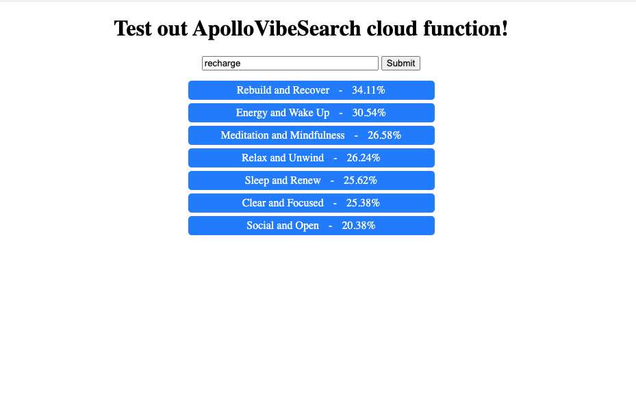

### All code is stored in the functions directory. Testins site only contains some html that is copied and pased into a firebase function.

# Generating Data
Uses a Gensim pre-trained GloVe model on Wikipedia to generate word similarities. First, it loads and tokenizes the CSV, then goes category by category and finds the similarity between that category and every word in the English language. The similarity is calculated by finding the similarity between every word in the setting’s description and every word in the English language. We take the max similarity between a given word and any word in the description and assign that as the similarity between that word and that setting. Basically, we don’t take the average similarity between a word and a setting, instead, we take the maximum because there could be a lot of different types of words in a description. All this data is then uploaded to firebase.

# Serving Data
The API is managed by a firebase function, which tokenizes the input string, pulls all the files for the words in the input, averages the similarities for each category, and finally sorts the settings by similarity. It returns a JSON file, or if the UI URL parameter is set to true, it returns a basic UI for testing purposes.

